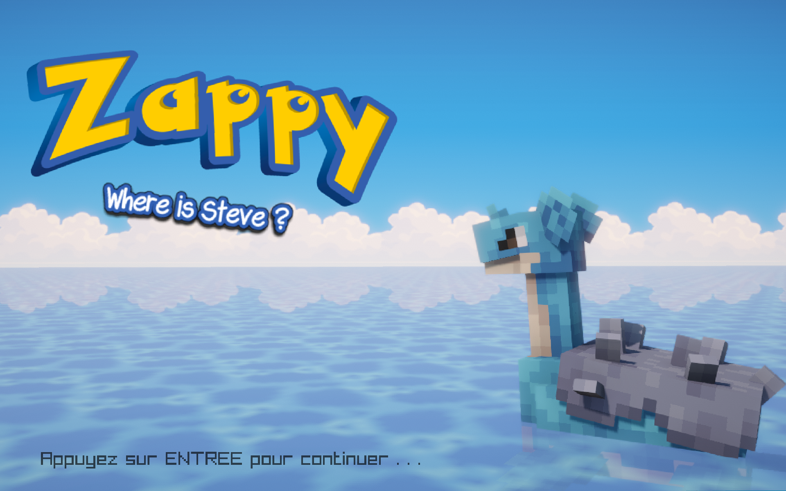

# Zappy

A network game where autonomous AI clients compete on a tiled world to gather
resources and elevate their team to level 8. The project is split into three
independent binaries:

| Binary         | Language | Role                                                        |
| -------------- | -------- | ----------------------------------------------------------- |
| `zappy_server` | C        | Authoritative game server. Hosts the world and the game loop. |
| `zappy_gui`    | C++      | Graphical viewer. Connects as a spectator, draws the world.   |
| `zappy_ai`     | Python   | AI client. One process = one player.                          |

The server must be started first. The GUI and the AI both connect to it over TCP.


---

## 1. Requirements

Install these before building:

| Dependency   | Notes                                                          |
| ------------ | -------------------------------------------------------------- |
| `g++`        | C++20 support required                                          |
| **SFML 3.x** | The GUI's 2D module targets the SFML 3 API (tested on 3.1.0)     |
| `libconfig++`| Tested on 1.8.2                                                  |
| `python3`    | For the AI client (tested on 3.14)                               |
| `make`       |                                                                  |

Raylib is **vendored** in [gui/lib/raylib/](gui/lib/raylib/) and built automatically, so you do
not need it installed system-wide.

Check that SFML and libconfig are visible to `pkg-config`:

```bash
pkg-config --modversion sfml-graphics libconfig++
```

> **Note on SFML:** the GUI requires SFML **3**, not 2.x. The two are not source
> compatible. Both Linux and macOS now resolve SFML and libconfig through
> `pkg-config`, so `brew install sfml libconfig` (SFML 3) is all macOS needs.

Python dependencies are only needed to run the test suite:

```bash
pip install -r requirements.txt
```

---

## 2. Build

From the repository root:

```bash
make
```

This builds all three binaries and copies them to the repository root:
`zappy_server`, `zappy_gui`, `zappy_ai`.

The first build is slow because it compiles the vendored raylib.

Other targets:

```bash
make re       # full rebuild
make clean    # remove object files
make fclean   # remove object files and binaries
```

> **Gotcha:** `make server`, `make gui` and `make ai` **do nothing**. The root
> [Makefile](Makefile) declares no `.PHONY`, and directories with those exact names exist,
> so `make` considers the targets already up to date. To rebuild a single part,
> use the sub-Makefile directly:
>
> ```bash
> make -C server
> make -C gui
> make -C ai
> ```

---

## 3. Launch

Use **three terminals**, in this order.

### Terminal 1: the server

```text
USAGE: ./zappy_server -p [port] -x [width] -y [height] -n {name1} {name2} ... {namex} -c [clientsNb] -f [freq]
```

| Flag | Meaning                                                   |
| ---- | --------------------------------------------------------- |
| `-p` | Port to listen on                                          |
| `-x` | World width (**must be between 10 and 30**)                |
| `-y` | World height (**must be between 10 and 30**)               |
| `-n` | Space-separated list of team names                         |
| `-c` | Max number of clients allowed per team                     |
| `-f` | Frequency: reciprocal of the time unit for action execution |

All six flags are mandatory. Example:

```bash
./zappy_server -p 4242 -x 10 -y 10 -n team1 team2 -c 5 -f 100
```

A higher `-f` makes the game run faster (`-f 100` is brisk, `-f 2` is slow enough
to watch individual actions).

> **Important:** the server watches `stdin` and shuts down on EOF
> ([server/src/zappy_client.c:171](server/src/zappy_client.c#L171)). Backgrounding it with a plain `&`
> closes stdin and the server exits immediately with `Ctrl+D detected. Exiting...`.
> Run it in its own foreground terminal, or keep stdin open:
>
> ```bash
> tail -f /dev/null | ./zappy_server -p 4242 -x 10 -y 10 -n team1 team2 -c 5 -f 100 &
> ```
>
> If the port is already taken the server prints `zappy_server: Socket bind failed.`
> and exits, so pick another port.

### Terminal 2: the GUI

```text
USAGE: ./zappy_gui -p port -h machine
```

| Flag | Meaning                                                        |
| ---- | -------------------------------------------------------------- |
| `-p` | Server port (required)                                          |
| `-h` | Server address (defaults to `127.0.0.1`)                        |
| `-d` | Use the **2D SFML** renderer instead of the default 3D raylib one |

```bash
./zappy_gui -p 4242 -h 127.0.0.1        # 3D raylib view (default)
./zappy_gui -p 4242 -h 127.0.0.1 -d     # 2D SFML view
```

> **Run it from the repository root.** The GUI looks for its assets in `./assets`
> then `./gui/assets` relative to the current directory, and exits with
> `Folder assets not found` if neither exists ([gui/main.cpp:36-43](gui/main.cpp#L36-L43)). So the repo
> root and the `gui/` directory both work. Other directories do not.

### Terminal 3: the AI clients

```text
USAGE: ./zappy_ai -p port -n name -h machine
```

| Flag | Meaning                                                     |
| ---- | ----------------------------------------------------------- |
| `-p` | Server port                                                  |
| `-n` | Team name (**must match one of the server's `-n` names**)    |
| `-h` | Server address                                               |
| `-d` | Debug mode: print the protocol exchange to stdout            |

```bash
./zappy_ai -p 4242 -n team1 -h 127.0.0.1
```

One process is one player, so run the command once per player you want. Each team
accepts at most `-c` clients. Connections beyond that are refused.

To spawn a whole team at once, [ai/launch_army.sh](ai/launch_army.sh) starts 20 clients in the
background, but note its port (`2000`) and team name (`oui`) are hardcoded, so
edit it to match your server before using it.

### Full example

```bash
# terminal 1
./zappy_server -p 4242 -x 10 -y 10 -n team1 team2 -c 5 -f 100

# terminal 2
./zappy_gui -p 4242 -h 127.0.0.1

# terminal 3
./zappy_ai -p 4242 -n team1 -h 127.0.0.1 &
./zappy_ai -p 4242 -n team1 -h 127.0.0.1 &
./zappy_ai -p 4242 -n team2 -h 127.0.0.1 &
```

Every binary also accepts a help flag: `./zappy_server -help`, `./zappy_gui -help`,
`./zappy_ai --help`.

---

## 4. GUI controls

### 3D view (raylib, default)

| Key             | Action                              |
| --------------- | ----------------------------------- |
| `Space`         | Move camera up                      |
| `Left Shift`    | Move camera down                    |
| `N`             | Toggle the HUD / first-person mode  |
| `G`             | Toggle debug mode                   |
| `1` / `2`       | Grow / shrink the displayed map     |
| `Escape`        | Open the escape menu                |
| Mouse wheel     | Scroll the HUD (when the HUD is open) |
| Left click      | Select a player on the focused tile (when the HUD is open) |

### 2D view (SFML, `-d`)

| Key                   | Action                    |
| --------------------- | ------------------------- |
| `Z`/`W`, `S`, `Q`/`A`, `D` | Pan the view         |
| `Up` / `Down`         | Zoom out / in             |
| `Left` / `Right`      | Rotate the view           |
| `X` / `C`             | Increase / decrease pan speed |
| `Space`               | Reset the view            |
| `Escape`              | Quit                      |

---

## 5. Tests

```bash
make tests_run
```

Runs the AI's `pytest` suite plus the GUI and server test targets. The AI tests
alone:

```bash
make ai_tests
```

The server's unit tests link against [Criterion](https://github.com/Snaipe/Criterion).

---

## 6. Known issues

- **The server does not build on macOS.** [server/Makefile](server/Makefile) compiles the C
  sources with `g++`, which trips over `sigaction` and other POSIX details on
  macOS. Build it on Linux, or use one of the reference binaries below.
- `make server` / `make gui` / `make ai` silently do nothing. Use `make -C <dir>`
  (see [Build](#2-build)).

### Reference server binaries

The Epitech Zappy **reference server** is checked in for both platforms so the GUI
and AI can be exercised without a working local server build:

| File                                                             | Platform          |
| ---------------------------------------------------------------- | ----------------- |
| [zappy_reference_server_linux](zappy_reference_server_linux)     | Linux x86-64      |
| [zappy_reference_server_macos](zappy_reference_server_macos)     | macOS arm64       |

They speak the same protocol as `zappy_server` (plus a few extra flags such as
`--auto-start`, `--display-eggs` and `--game_duration`). Run one in place of
`./zappy_server`:

```bash
./zappy_reference_server_macos -p 4242 -x 10 -y 10 -n team1 team2 -c 5 -f 100
```

---

## 7. Acknowledgements

- **[raylib](https://www.raylib.com/)** by Ramon Santamaria and contributors is the
  3D rendering, windowing and audio backend of `zappy_gui`. Vendored in
  [gui/lib/raylib/](gui/lib/raylib/) (v6.0) together with
  **[raylib-cpp](https://github.com/RobLoach/raylib-cpp)** (v6.0.3). Both are
  released under the zlib/libpng license.
- **[Cobblemon](https://cobblemon.com/)** provides the Pokémon 3D models, animations
  and Poké Ball assets under [gui/assets/models/](gui/assets/models/). They remain the
  property of their respective creators and are used here for a non-commercial
  student project. Pokémon and Poké Ball are trademarks of Nintendo, Game Freak and
  The Pokémon Company. This project is not affiliated with or endorsed by them.
